# Atlas Cluster Automation Using Scheduled Triggers

Every action you can take in the Atlas user interface is backed by a corresponding [Administration API](https://www.mongodb.com/docs/atlas/reference/api-resources-spec/), which allows you to easily bring automation to your Atlas deployments. Some of the more common forms of Atlas automation occur on a schedule, such as pausing a cluster that’s only used for testing in the evening and resuming the cluster again in the morning.

Having an API to automate Atlas actions is great, but you’re still on the hook for writing the script that calls the API, finding a place to host the script, and setting up the job to call the script on your desired schedule. This is where Atlas [Scheduled Triggers](https://www.mongodb.com/docs/atlas/triggers/#scheduled-triggers) come to the rescue.

In this article I will show you how a Scheduled Trigger can be used to easily incorporate automation into your environment. In addition to pausing and unpausing a cluster, I’ll similarly show how cluster scale up and down events could also be placed on a schedule. Both of these activities allow you to save on costs for when you either don’t need the cluster (paused), or don’t need it to support peak workloads (scale down).


# Architecture

Three example scheduled triggers are provided in this solution. Each trigger has an associated trigger function. The bulk of the work is handled by the **modifyCluster** function, which as the name implies is a generic function for making modifications to a cluster. It's a wrapper around the Atlas [Update Configuration of One Cluster](https://www.mongodb.com/docs/atlas/reference/api-resources-spec/#operation/updateConfigurationOfOneCluster) Admin API.

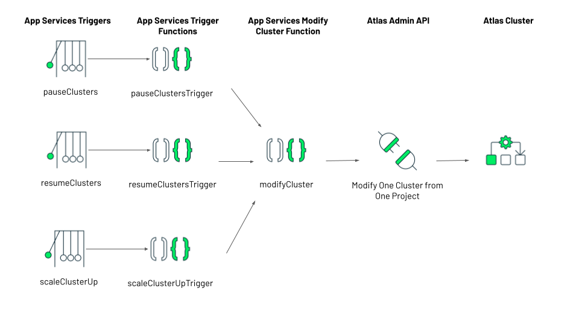


# Preparation


## Generate an API Key

In order to call the Atlas Administrative APIs, you'll first need an [API Key](https://www.mongodb.com/docs/atlas/configure-api-access/) with the 

[Organization Owner](https://www.mongodb.com/docs/atlas/reference/user-roles/#Organization-Owner) role. API Keys are created in the Access Manager. At the Organization level (not the Project level), select **Access Manager **from the menu on the left: \


Then select the **API Keys** tab.

Create a new key, giving it a good description. Assign the key **[Organization Owner](https://www.mongodb.com/docs/atlas/reference/user-roles/#Organization-Owner)** permissions, which will allow it to manage any of the projects in the organization. 


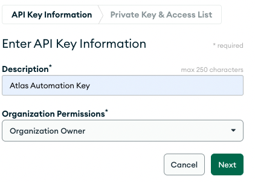


Click **Next** and make a note of your Private Key:


Let's limit who can use our API key by adding an access list. In our case, the API key is going to be used by a Trigger which is a component of Atlas App Services. You will find the list of IP addresses used by App Services in the documentation under [Firewall Configuration](https://www.mongodb.com/docs/atlas/app-services/security/?_ga=2.141120567.467587052.1654532140-1042404311.1621885569&_gac=1.123940344.1654536456.CjwKCAjwy_aUBhACEiwA2IHHQMNKPJhxelRKhOkjaFcX_en2YM5HUl6eDgj0T1jPp8LzU5SSyMT2vhoCuCYQAvD_BwE#firewall-configuration). Note, each IP address must be added individually. 


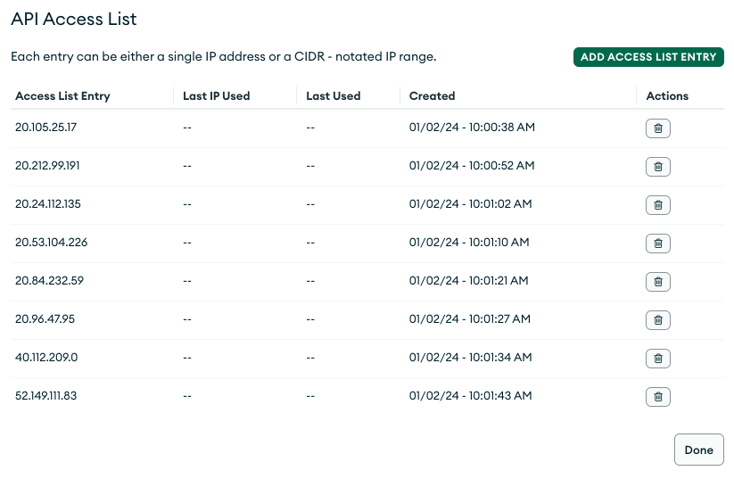


Click **Done.**


# Deployment


## Create a Project for Automation

Since this solution works across your entire Atlas organization, I like to host it in its own dedicated Atlas Project.


## Create and Application

We will host our trigger in an [Atlas App Services](https://www.mongodb.com/docs/atlas/app-services/) Application. To begin, just click the App Services tab: \
 \


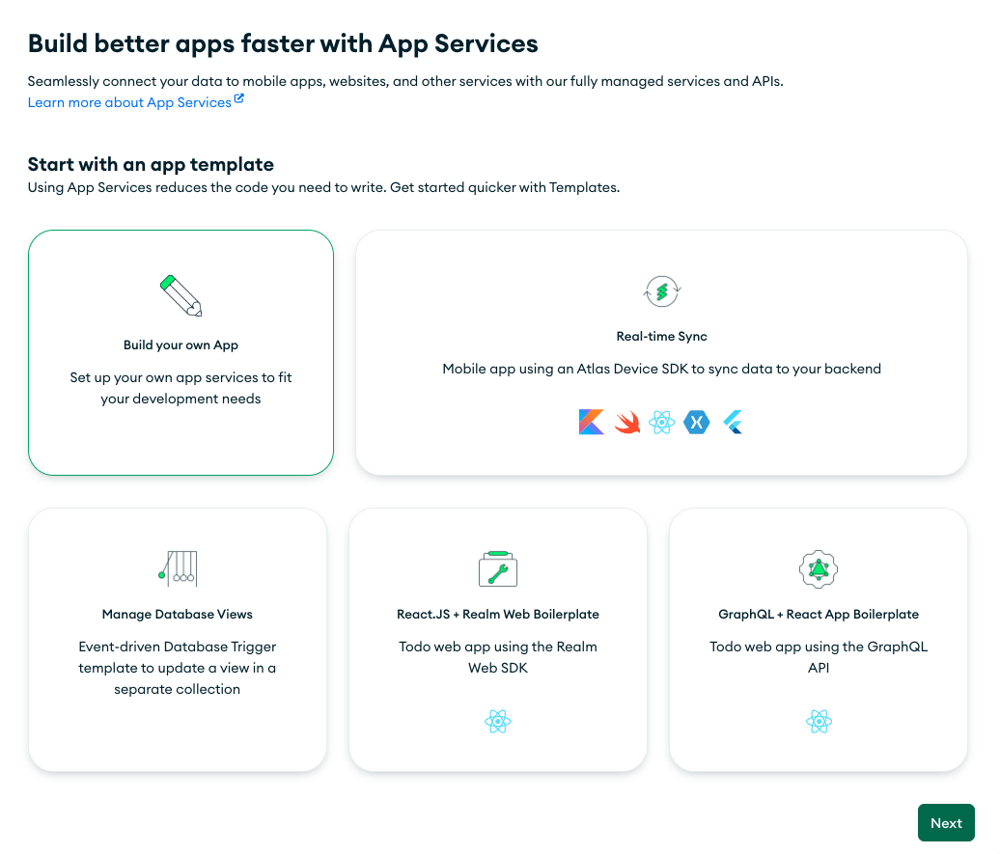


You'll see that App Services offers a bunch of templates to get you started. For this use case, just select the first option to **Build your own App**:


You'll then be presented with options to link a data source, name your application and choose a deployment model. The current iteration of this utility doesn't use a data source, so you can ignore that step (a free cluster for you regardless). You can also leave the [deployment model](https://www.mongodb.com/docs/atlas/app-services/manage-apps/deploy/deployment-models-and-regions/) at its default (global), unless you want to limit the application to a specific region. 

I've named the application **Automation App**:

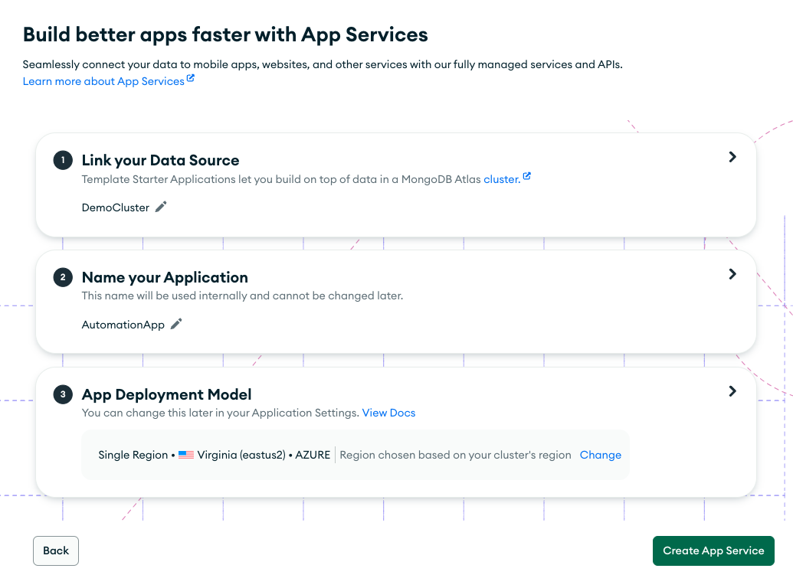


From here, you have the option to simply import the Realm application and adjust any of the functions to fit your needs. If you prefer to build the application from scratch, skip to the next section.


# Import Option


## Step 1: Store the API Secret Key

The extract has a dependency on the API Secret Key, thus the import will fail if it is not configured beforehand.

Use the **Values** menu on the left to Create a Secret named **AtlasPrivateKeySecret** containing your private key (the secret is not in quotes): \


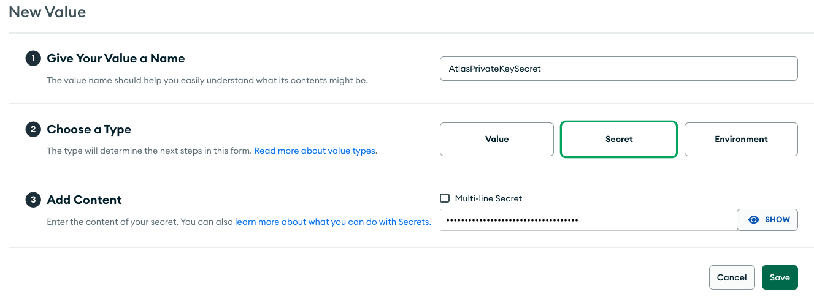


## Step 2: Install the Realm CLI

The Realm CLI is available on npm. To install the Realm CLI on your system, ensure that you have [Node.js](https://nodejs.org/en/download/) installed and then run the following command in your shell:

**npm install -g mongodb-realm-cli**


## Step 3: Extract the Application Archive

[Download](https://github.com/wbleonard/atlas_cluster_automation/blob/master/export/AutomationApp.zip?raw=true) and extract the AutomationApp.zip.


## Step 4: Log into Atlas

To configure your app with realm-cli, you must log in to Atlas using your API keys:

✗ realm-cli login --api-key="&lt;Public API Key>" --private-api-key="&lt;Private API Key>"

Successfully logged in


## Step 5: Get the Realm Application ID

Select the **App Settings** menu and copy your Application ID:


## Step 6: Import the Application

Run the following realm-cli push command from the directory where you extracted the export:
```
realm-cli push --remote="&lt;Your App ID>"

...
A summary of changes
...

? Please confirm the changes shown above Yes

Creating draft
Pushing changes
Deploying draft
Deployment complete
Successfully pushed app up:

After the import, replace the `AtlasPublicKey' with your API public key value.
```


## Review the Imported Application

The imported application includes 3 self-explanatory sample scheduled [triggers](https://www.mongodb.com/docs/atlas/app-services/triggers/scheduled-triggers/): \
 \


The 3 triggers have 3 associated [Functions](https://www.mongodb.com/docs/atlas/app-services/functions/). The pauseClustersTrigger and resumeClustersTrigger function supply a set of projects and clusters to pause, so these need to be adjusted to fit your needs:


```
 // Supply projectIDs and clusterNames...
  const projectIDs =[
  {
    id: '5c5db514c56c983b7e4a8701',
    names: [
      'Demo',
      'Demo2'
    ]
  },
  {
    id: '62d05595f08bd53924fa3634',
    names: [
      'ShardedMultiRegion'
    ]
  }
];
```


All 3 trigger functions call the **modifyCluster** function, where the bulk of the work is done.

In addition, you'll find two utility functions, **getProjectClusters** and **getProjects**. These functions are not utilized in this solution, but are provided for reference if you wanted to further automate these processes (that is, removing the hard coded project IDs and cluster names in the trigger functions):


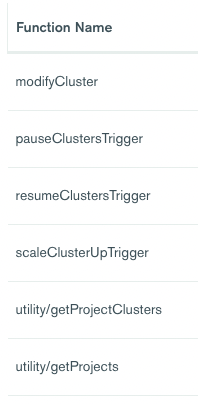


Now that you have reviewed the draft, as a final step go ahead and deploy the Realm application.


# Build it Yourself Option

To understand what's included in the application, here are the steps to build it yourself from scratch.


## Step 1: Store the API Keys

The functions we need to create will call the [Atlas Administration APIs](https://www.mongodb.com/docs/atlas/reference/api-resources-spec/), so we need to store our API Public and Private Keys, which we will do using [Values & Secrets](https://www.mongodb.com/docs/atlas/app-services/values-and-secrets/). The sample code I provide references these values as AtlasPublicKey and AtlasPrivateKey, so use those same names unless you want to change the code where they’re referenced.

You'll find **Values** under the BUILD menu:


## 


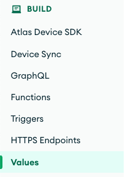


First, create a Value for your public key (_note, the key is in quotes_):


Create a Secret containing your private key (the secret is not in quotes):


The Secret cannot be accessed directly, so create a second Value that links to the secret:


## Step 2: Note the Project ID(s)

We need to note the IDs of the projects that have clusters we want to automate. Click the 3 dots in the upper left corner of the UI to open the Project Settings:


Under which you’ll find your Project ID:


## Step 3: Create the Functions

I will create two functions, a generic function to modify a cluster and a trigger function to iterate over the clusters to be paused. 

You'll find Functions under the BUILD menu: \
 \


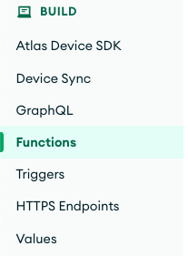


## modifyCluster

I’m only demonstrating a couple of things you can do with cluster automation, but the sky is really limitless. The following modifyCluster function is a generic wrapper around the [Update Configuration of One Cluster](https://www.mongodb.com/docs/atlas/reference/api-resources-spec/#operation/updateConfigurationOfOneCluster) API for calling the API from App Services (or Node.js for that matter). 

Create a New Function named **modifyCluster**. Set the function to Private as it will only be called by our trigger. The other default settings are fine:

 


Switch to the Function Editor tab and paste the following code:


```
/*
 * Modifies the cluster as defined by the body parameter. 
 * See https://docs.atlas.mongodb.com/reference/api/clusters-modify-one/
 *
 */
exports = async function(username, password, projectID, clusterName, body) {
  
  // Easy testing from the console
  if (username == "Hello world!") { 
    username = await context.values.get("AtlasPublicKey");
    password = await context.values.get("AtlasPrivateKey");
    projectID = "5c5db514c56c983b7e4a8701";
    clusterName = "Demo";
    body = {paused: false}
  }

  const arg = { 
    scheme: 'https', 
    host: 'cloud.mongodb.com', 
    path: 'api/atlas/v1.0/groups/' + projectID + '/clusters/' + clusterName, 
    username: username, 
    password: password,
    headers: {'Content-Type': ['application/json'], 'Accept-Encoding': ['bzip, deflate']}, 
    digestAuth:true,
    body: JSON.stringify(body)
  };
  
  // The response body is a BSON.Binary object. Parse it and return.
  response = await context.http.patch(arg);

  return EJSON.parse(response.body.text()); 
};
```


To test this function, you need to supply an API key, an API secret, a project Id, an associated cluster name to modify, and a payload containing the modifications you'd like to make. In our case it's simply setting the paused property.

By default, the Console supplies ‘Hello world!’ with test running a function, so my function code tests for that input and provides some default values for easy testing. 


```
  // Easy testing from the console
  if (username == "Hello world!") { 
    username = await context.values.get("AtlasPublicKey");
    password = await context.values.get("AtlasPrivateKey");
    projectID = "5c5db514c56c983b7e4a8701";
    clusterName = "Demo";
    body = {paused: false}
  }
```


Press the **Run** button to see the results, which will appear in the Result window:


And you should find you cluster being resumed (or paused):


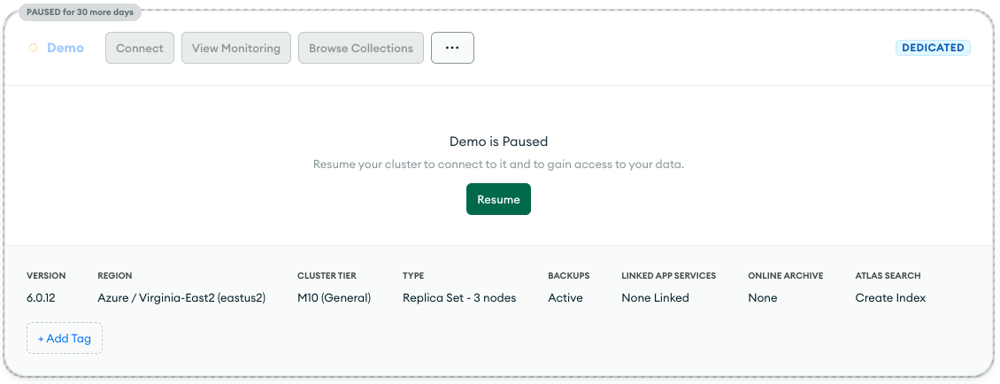


## pauseClustersTrigger

This function will be called by a trigger. As it's not possible to pass parameters to a scheduled trigger, it uses a hard-coded list of project Ids and associated cluster names to pause. Ideally these values would be stored in a collection with a nice UI to manage all of this, but that's a job for another day :-).

_In the appendix of this article, I provide functions that will get all projects and clusters in the organization. That would create a truly dynamic operation that would pause all clusters. You could then alternatively refactor the code to use an exclude list instead of an allow list._


```
/*
 * Iterates over the provided projects and clusters, pausing those clusters
 */
exports = async function() {
  
  // Supply projectIDs and clusterNames...
  const projectIDs = [{id:'5c5db514c56c983b7e4a8701', names:['Demo', 'Demo2']}, {id:'62d05595f08bd53924fa3634', names:['ShardedMultiRegion']}];

  // Get stored credentials...
  const username = context.values.get("AtlasPublicKey");
  const password = context.values.get("AtlasPrivateKey");

  // Set desired state...
  const body = {paused: true};

  var result = "";
  
  projectIDs.forEach(async function (project) {
    
    project.names.forEach(async function (cluster) {
      result = await context.functions.execute('modifyCluster', username, password, project.id, cluster, body);
      console.log("Cluster " + cluster + ": " + EJSON.stringify(result));
    });
  });
  
  return "Clusters Paused";
};
```


## Step 4: Create Trigger - pauseClusters

The ability to pause and resume a cluster is supported by the [Update Configuration of One Cluster](https://www.mongodb.com/docs/atlas/reference/api-resources-spec/#operation/updateConfigurationOfOneCluster) API. To begin, select Triggers from the menu on the left: \
 \


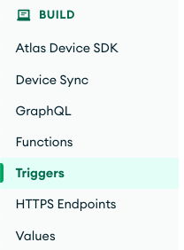


And add a trigger.

Set the Trigger Type to **Scheduled **and the name to **pauseClusters**: \


As for the schedule, you have the full power of [CRON Expressions](https://www.mongodb.com/docs/atlas/app-services/triggers/scheduled-triggers/) at your fingertips. For this exercise, let’s assume we want to pause the cluster every evening at 6pm. Select **Advanced** and set the CRON schedule to **0 22 * * ***. _Note, the time is in GMT, so adjust accordingly for your timezone. As this cluster is running in US East, I’m going to add 4 hours:_ \
 \


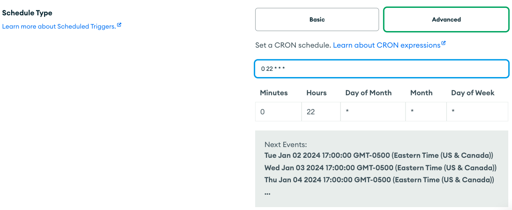


Check the Next Events window to validate the job will run when you desire. \
 \
The final step is to select the function for the trigger to execute. Select the **pauseClustersTrigger** function.


And **Save** the trigger.

The final step is to **REVIEW DRAFT & DEPLOY**. 


# Resume the Cluster

You could opt to manually resume the cluster(s) as it’s needed. But for completeness, let’s assume we want the cluster(s) to automatically resume at 8am US East every weekday morning. 

Duplicate the pauseClustersTrigger function to a new function named **resumeClustersTriggger**


At a minimum, edit the function code setting **paused** to **false**. You could also adjust the projectIDs and clusterNames to a subset of projects to resume:


```
/*
 * Iterates over the provided projects and clusters, resuming those clusters
 */
exports = async function() {
  
  // Supply projectIDs and clusterNames...
  const projectIDs = [{id:'5c5db514c56c983b7e4a8701', names:['Demo', 'Demo2']}, {id:'62d05595f08bd53924fa3634', names:['ShardedMultiRegion']}];

  // Get stored credentials...
  const username = context.values.get("AtlasPublicKey");
  const password = context.values.get("AtlasPrivateKey");

  // Set desired state...
  const body = {paused: false};

  var result = "";
  
  projectIDs.forEach(async function (project) {
    
    project.names.forEach(async function (cluster) {
      result = await context.functions.execute('modifyCluster', username, password, project.id, cluster, body);
      console.log("Cluster " + cluster + ": " + EJSON.stringify(result));
    });
  });
  
  return "Clusters Paused";
};
```


Then add a new scheduled trigger named **resumeClusters**. Set the CRON schedule to: **0 12 * * 1-5**. The Next Events validates for us this is exactly what we want: \
 \


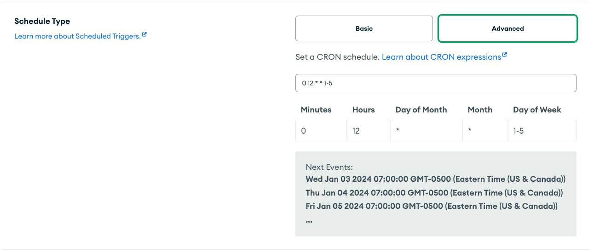


# Create Trigger: Scaling Up and Down

It’s not uncommon to have workloads that are more demanding during certain hours of the day or days of the week. Rather than running your cluster to support peak capacity, you can use this same approach to schedule your cluster to scale up and down as your workload requires it. 


```
Note: Atlas Clusters already support Auto-Scaling, which may very well suit your needs. The approach described here will let you definitively control when your cluster scales up and down.
```


Let’s say we want to scale up our cluster every day at 9am before our store opens for business.

Add a new function named **scaleClusterUpTrigger**. Here’s the function code. It’s very similar to before, except the body’s been changed to alter the provider settings:


```
exports = async function() {
  
  // Supply projectID and clusterNames...
  const projectID = '<Project ID>';
  const clusterName = '<Cluster Name>';

  // Get stored credentials...
  const username = context.values.get("AtlasPublicKey");
  const password = context.values.get("AtlasPrivateKey");

  // Set the desired instance size...
  const body =    {
      "providerSettings" : {
        "providerName" : "AWS",
        "instanceSizeName" : "M20"
      }
    };
  
  result = await context.functions.execute('modifyCluster', username, password, projectID, clusterName, body);
  console.log(EJSON.stringify(result));
  
  if (result.error) {
    return result;
  }

  return clusterName + " scaled up"; 
};
```


Then add a scheduled trigger named **scaleClusterUp**. Set the CRON schedule to: **0 13 * * ***. 

Scaling a cluster back down would simply be another trigger, scheduled to run when you want, using the same code above, setting the **instanceSizeName** to whatever you desire.

And that’s it. I hope you find this beneficial. You should be able to use the techniques described here to easily call any MongoDB Atlas Admin API endpoint from Atlas App Services.


# Appendix \
getProjects

This standalone function can be test run from the App Services console to see the list of all the projects in your organization. You could also call it from other functions to get a list of projects:


```
/*
 * Returns an array of the projects in the organization
 * See https://docs.atlas.mongodb.com/reference/api/project-get-all/
 *
 * Returns an array of objects, e.g.
 *
 * {
 * "clusterCount": {
 *      "$numberInt": "1"
 *    },
 *    "created": "2021-05-11T18:24:48Z",
 *    "id": "609acbef1b76b53fcd37c8e1",
 *    "links": [
 *      {
 *        "href": "https://cloud.mongodb.com/api/atlas/v1.0/groups/609acbef1b76b53fcd37c8e1",
 *        "rel": "self"
 *      }
 *    ],
 *    "name": "mg-training-sample",
 *    "orgId": "5b4e2d803b34b965050f1835"
 *  }
  *
 */
exports = async function() {
  
  // Get stored credentials...
  const username = await context.values.get("AtlasPublicKey");
  const password = await context.values.get("AtlasPrivateKey");
  
  const arg = { 
    scheme: 'https', 
    host: 'cloud.mongodb.com', 
    path: 'api/atlas/v1.0/groups', 
    username: username, 
    password: password,
    headers: {'Content-Type': ['application/json'], 'Accept-Encoding': ['bzip, deflate']}, 
    digestAuth:true,
  };
  
  // The response body is a BSON.Binary object. Parse it and return.
  response = await context.http.get(arg);

  return EJSON.parse(response.body.text()).results; 
};
```


## getProjectClusters

Another example function that will return the cluster details for a provided project.

_To test this function, you need to supply a projectId. By default, the Console supplies ‘Hello world!’, so I test for that input and provide some default values for easy testing._


```
/*
 * Returns an array of the clusters for the supplied project ID.
 * See https://docs.atlas.mongodb.com/reference/api/clusters-get-all/
 *
 * Returns an array of objects. See the API documentation for details.
 * 
 */
exports = async function(project_id) {
  
  if (project_id == "Hello world!") { // Easy testing from the console
    project_id = "5e8f8268d896f55ac04969a1"
  }
  
  // Get stored credentials...
  const username = await context.values.get("AtlasPublicKey");
  const password = await context.values.get("AtlasPrivateKey");
  
  const arg = { 
    scheme: 'https', 
    host: 'cloud.mongodb.com', 
    path: `api/atlas/v1.0/groups/${project_id}/clusters`, 
    username: username, 
    password: password,
    headers: {'Content-Type': ['application/json'], 'Accept-Encoding': ['bzip, deflate']}, 
    digestAuth:true,
  };
  
  // The response body is a BSON.Binary object. Parse it and return.
  response = await context.http.get(arg);

  return EJSON.parse(response.body.text()).results; 
};
```

