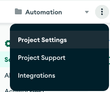
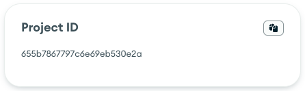
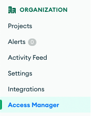
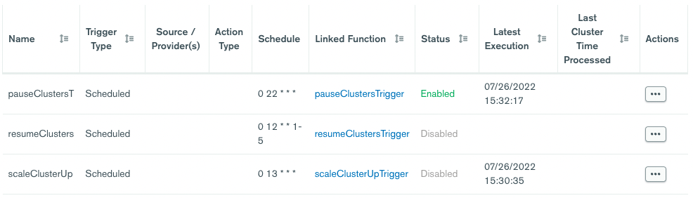

# Atlas Cluster Automation Using Scheduled Triggers

Every action you can take in the Atlas user interface is backed by a corresponding [REST API](https://docs.atlas.mongodb.com/reference/api-resources/), which allows you to easily bring automation to your Atlas deployments. Some of the more common forms of Atlas automation occur on a schedule, such as pausing a cluster that’s only used for testing in the evenings and resuming the cluster again in the morning.

Having an API to automate Atlas actions is great, but you’re still on the hook for writing the script that calls the API, finding a place to host the script, and setting up the job to call the script on your desired schedule. This is where Atlas [Scheduled Triggers](https://docs.atlas.mongodb.com/triggers/#scheduled-triggers) come to the rescue.

In this article I will show you how a Scheduled Trigger can be used to easily incorporate automation into your environment. In addition to pausing and unpausing a cluster, I’ll similarly show how cluster scale up and down events could also be placed on a schedule. Both of these activities allow you to save costs for when you either don’t need the cluster (paused), or don’t need it to support peak workloads (scale down).


## Preparation


### Identify Trigger Host Cluster

Atlas triggers do not fire when their associated cluster is paused, so the trigger needs to be linked to a cluster that never pauses. Fortunately, Atlas supports a forever free sandbox cluster (M0). If you don’t have a cluster you can use that will never be paused (such as a production cluster), create an M0 cluster to use for this exercise. Please note that you can only have one M0 cluster per project.


### Note the Project ID

We’ll need to pass the project ID as a path parameter in our API calls. Click the 3 dots in the upper left corner of the UI to open the Project Settings:





Under which you’ll find your Project ID:

 


### Generate an API Key

Even if you already have an [API Key](https://docs.atlas.mongodb.com/configure-api-access/), it’s good to generate a new one for this use case so we can easily identify that the API was called by the Atlas Trigger. 

At the Organization level (not the Project level), select **Access Manager** from the menu on the left: 



Then select the **API Keys** tab:


Click **Next** and make a note of your Private Key:


Let’s next [whitelist](https://docs.atlas.mongodb.com/configure-api-access/#enable-api-whitelisting-for-your-organization) the IPs of the Realm servers that will be using our key. Click **Add Whitelist Entry** and add the following IPs:

```
18.211.240.224
18.210.66.32
18.213.24.164
54.69.74.169
54.203.157.107
18.202.2.23
54.76.145.131
52.63.26.53
13.236.189.10
```


## Create Trigger: Scheduled Pause

The ability to pause and resume a cluster is supported by the [Modify Cluster](https://docs.atlas.mongodb.com/reference/api/clusters-modify-one/) API. To begin, select **Triggers** from the menu on the left: 



And add a trigger.

Set the Trigger Type to **Scheduled** and the name to **pauseClusters**:


As for the schedule, you have the full power of [CRON Expressions](https://docs.mongodb.com/stitch/triggers/cron-expressions/) at your fingertips. For this exercise, let’s assume we want to pause the cluster every evening at 6pm. Select **Advanced** and set the CRON schedule to **`0 23 * * *`**. _Note, the time is in GMT, so adjust accordingly for your timezone. As this cluster is running in US East, I’m going to add 5 hours:_ 


Check the Next Events window to validate the job will run when you desire. \
 \
The next step is to link the trigger to the cluster, and it’s important to link to the cluster we identified above that will always be running. I created a M0 cluster called Automation for this purpose:


Once the cluster is linked for the first trigger, the cluster will not need to be re-linked for additional triggers created in the same project.

Finally, we need to provide the function that will run when the trigger fires. Replace the provided function code with the following, filling in the value for your `projectID` and `clusterNames`. Note the function as written can pause multiple clusters, providing the cluster names as an array:


```javascript
exports = async function() {
  
  // Supply projectID and clusterNames...
  const projectID = '<Project ID>';
  const clusterNames = ['<Cluster Name>', '<Cluster Name>'];

  // Get stored credentials...
  const username = context.values.get("AtlasPublicKey");
  const password = context.values.get("AtlasPrivateKey");

  // Set desired state...
  const body = {paused: true};

  var result = "";
  
  clusterNames.forEach(async function (name) {
    result = await context.functions.execute('modifyCluster', username, password, projectID, name, body)
    console.log("Cluster " + name + ": " + EJSON.stringify(result));
    
    if (result.error) { 
      return result;
    }
  })


  return clusterNames.length + " clusters paused"; 
};
```


And **Save** the trigger.

If you attempt to run the trigger, it will fail because it’s looking up values and calling a wrapper function, **modifyCluster**, we haven’t written yet. Let’s implement them now...


## Supply Atlas Credentials and Implement modifyCluster

When we created the Atlas Trigger, behind the scenes, a Realm application was created to run the trigger. It’s in that application where we’ll host our Atlas credentials and modifyCluster function.

Select **Realm** from the menu on the top: 


And you’ll find a **Triggers_RealmApp** has been created for us: 


Click the **Triggers_RealmApp** to open the application.


### Atlas Credentials

Our Atlas Trigger references two values that represent our Atlas credentials, the **`AtlasPublicKey`** and **`AtlasPrivateKey`**. Here’s where we’ll supply those values to the trigger.

Select **Values & Secrets** from the menu on the left: 


Click the **Create New Value** button.

Set the Value Name to **AtlasPublicKey** and enter your public key value you generated earlier, enclosed in quotes: 


Click **Save**.

Add a second Value named **AtlasPrivateKey**, this time of type **Secret**: 


Click **Save**.

### modifyCluster Function

I’m only demonstrating a couple of things you can do with cluster automation, but the sky is really limitless. The following `modifyCluster` function is a generic wrapper around the [Modify Cluster](https://docs.atlas.mongodb.com/reference/api/clusters-modify-one/) API for calling the API from Realm (or Node.js for that matter). 

Open the app and select **Functions** from the menu on the left: 


Click the **Create New Function** button. Name the function **modifyCluster**:


Leave the other fields at their defaults and click **Save** to open the Function Editor. Paste the following code into the editor:


```JavaScript
/*
 * Modifies the cluster as defined by the body parameter. 
 * See https://docs.atlas.mongodb.com/reference/api/clusters-modify-one/
 *
 */
exports = async function(username, password, projectID, clusterName, body) {
  
  const arg = { 
    scheme: 'https', 
    host: 'cloud.mongodb.com', 
    path: 'api/atlas/v1.0/groups/' + projectID + '/clusters/' + clusterName, 
    username: username, 
    password: password,
    headers: {'Content-Type': ['application/json'], 'Accept-Encoding': ['bzip, deflate']}, 
    digestAuth:true,
    body: JSON.stringify(body)
  };
  
  // The response body is a BSON.Binary object. Parse it and return.
  response = await context.http.patch(arg);

  return EJSON.parse(response.body.text()); 
};
```


As stated above, this is simply a generic wrapper around the modify cluster API. **Save** the function then click **REVIEW & DEPLOY CHANGES**: 


## Test the Trigger

Click the **Atlas** tab to return to Atlas: 


Open your **pauseClusters** trigger and click **Run** to test it. You should see output similar to the following: 


More importantly, you should see your cluster entering a paused state:


 
## Resume the Cluster

You could opt to manually resume the cluster(s) as it’s needed. But for completeness, let’s assume we want the cluster(s) to automatically resume at 8am US East every weekday morning. 

Add a new Atlas scheduled trigger named **resumeClusters**. Set the CRON schedule to: `0 13 * * 1-5`. The Next Events validates for us this is exactly what we want: 


The function code is almost identical to **pauseCluster**. We simply set paused to **false** and update our return statement to indicate clusters were resumed:


```javascript
exports = async function() {
  
  // Supply projectID and clusterNames...
  const projectID = '<Project ID>';
  const clusterNames = ['<Cluster Name>', '<Cluster Name>'];

  // Get stored credentials...
  const username = context.values.get("AtlasPublicKey");
  const password = context.values.get("AtlasPrivateKey");

  // Set desired state...
  const body = {paused: false};

  var result = "";
  
  clusterNames.forEach(async function (name) {
    result = await context.functions.execute('modifyCluster', username, password, projectID, name, body)
    console.log("Cluster " + name + ": " + EJSON.stringify(result));
    
    if (result.error) { 
      return result;
    }
  })


  return clusterNames.length + " clusters resumed"; 
};
```


## Create Trigger: Scaling Up and Down

It’s not uncommon to have workloads that are more demanding during certain hours of the day or days of the week. Rather than running your cluster to support peak capacity, you can use this same approach to schedule your cluster to scale up and down as your workload requires it. 


<div class="callout">

Note: Atlas Clusters already support [Auto-Scaling](https://docs.atlas.mongodb.com/cluster-autoscaling/), which may very well suit your needs. The approach described here will let you definitively control when your cluster scales up and down.

</div>


Let’s say we want to scale up our cluster every day at 9am before our store opens for business.

Add a new Atlas scheduled trigger named **scaleClusterUp**. Set the CRON schedule to: **`0 14 * * *`**. 

Here’s the function code. It’s very similar to before, except the body’s been changed to alter the provider settings:


```javascript
exports = async function() {
  
  // Supply projectID and clusterNames...
  const projectID = '<Project ID>';
  const clusterName = <Cluster Name>;

  // Get stored credentials...
  const username = context.values.get("AtlasPublicKey");
  const password = context.values.get("AtlasPrivateKey");

  // Set the desired instance size...
  const body =    {
      "providerSettings" : {
        "providerName" : "AWS",
        "instanceSizeName" : "M20"
      }
    };
  
  result = await context.functions.execute('modifyCluster', username, password, projectID, clusterName, body);
  console.log(EJSON.stringify(result));
  
  if (result.error) {
    return result;
  }

  return clusterName + " scaled up"; 
};
```


Scaling a cluster back down would simply be another trigger, scheduled to run when you want, using the same code above, setting the **instanceSizeName** to whatever you desire.

And that’s it. I hope you find this beneficial. You should be able to use the techniques described here to easily call any MongoDB Atlas API from Realm.
